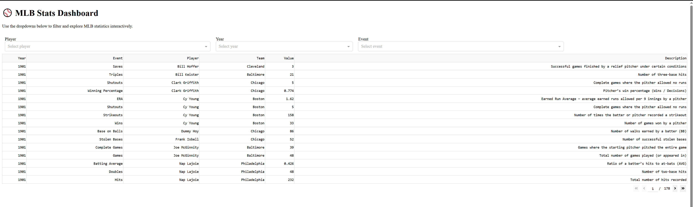
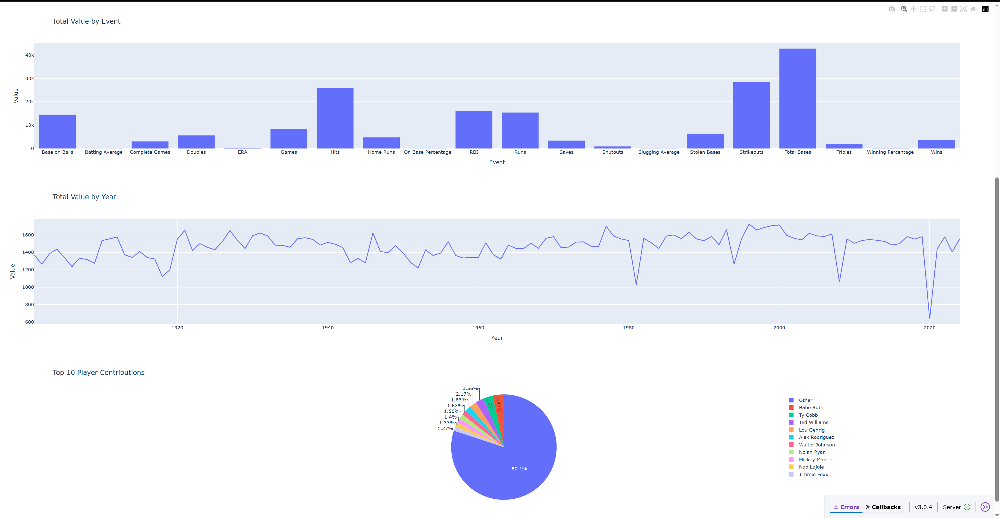

# Python Final Project — Web Scraping & Dashboard (Dash)

## Project Overview

This project is an end-to-end data pipeline that involves:

- Scraping historical baseball data using **Selenium**
- Saving the raw data as **CSV files**
- Importing data into a **SQLite** database
- Querying the database via the **command line**
- Building an interactive dashboard using **Dash**

## Project Structure

```
python_final_project/
├── app/                    # Dash visualization app
│   └── dashboard.py
├── cli/                    # Command-line interface
│   └── query_mlb.py
├── data/                   # CSV data and database
│   ├── american_league_pitcher_stats_1901_2024.csv
│   ├── american_league_stats_1901_2024.csv
│   ├── mlb_events.csv
│   └── mlb_stats.db
├── scraper/                # Scripts for data scraping and processing
│   ├── import_to_sqlite.py
│   ├── list_events.py
│   └── scraper.py
├── screenshots/
│   ├── charts.png
│   └── table.png
├── venv/                   # Virtual environment (gitignored)
├── requirements.txt        # List of dependencies
├── README.md               # Project overview and instructions
└── .gitignore              # Git ignore rules

```


## How to Run the Project

### 1. Install dependencies

```bash
pip install -r requirements.txt
```

### 2. Run the scraper

```bash
python scraper/scraper.py
```

### 3. Import data into SQLite

```bash
python scraper/import_to_sqlite.py
```

### 4. Launch the dashboard

```bash
python app/dashboard.py
```

## Technologies Used

 - Python
 - Selenium – for web scraping
 - Pandas – for data cleaning and transformation
 - SQLite – as the database engine
 - Dash – for dashboard visualization

## Data Source
Data is scraped from the Major League Baseball History website, which includes player stats, historical events, and yearly achievements.

## Screenshots



## Author
Created by [Alena Danilchenko](https://github.com/anelka777).
This project is part of the CTD Python course — Lesson 14 Final Project.

## License
This project is for educational use only.